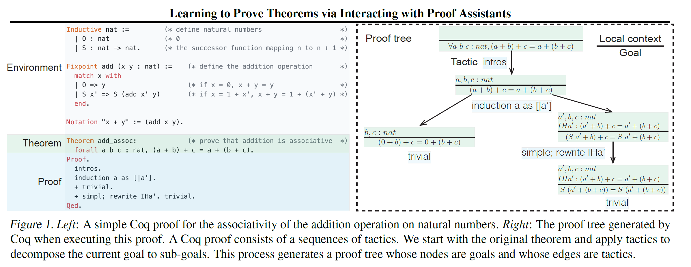
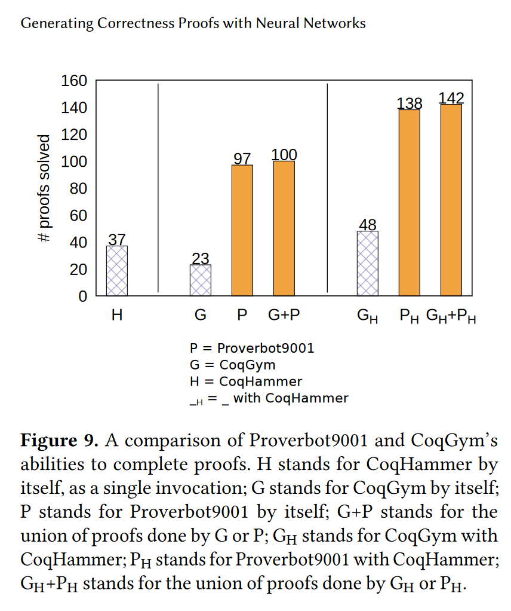

Link to this document: [`aleloi.github.io/master_project_proposal.html`](https://aleloi.github.io/master_project_proposal.html)

Date: August 2022
# Automating formal theorem proving with AI and ML
<!-- Possible other titles: Something along the lines of "Generating proof -->
<!-- terms in dependent type theory with Machine Learning". Or "Automating -->
<!-- formalized proof steps with ML". -->


## Master thesis project proposal
This document contains possible master
project ideas for a master project to be done by me  during
period 1 and 2 of 2023. I am a second year masters student in [Machine Learning](https://www.kth.se/en/studies/master/machine-learning/msc-machine-learning-1.48533) at KTH. The target audience is potential supervisors and examiners, people that may direct me to potential supervisors, or people that may suggest ideas to try and papers to read.

The document contains 
* an [introduction](#introduction-to-formal-verification) to the topic;
* a [case study](#case-study-friendship-theorem-and-automation) of proof
automation systems available for a real formalization project that I've done during this summer;
* an incomplete survey of existing ML-based proof automation methods for Coq;
* a list of possible [Master project ideas](#master-project-ideas); hopefully somewhat
  feasible given the time frame, my prior knowledge and computation
  resources.

### TLDR
I found that the state of proof automation for Coq proof
development with `mathcomp` and `SSReflect` is rather poor. The most
useful system I found was `autorewrite` which has existed since at least 1999.
To my knowledge, it has not underwent any significant changes. Next in
order of usefulness is the `sauto` part of CoqHammer, and the `ring`
and `lia` tactics.

I want to spend a full academic semester on improving Coq automation.
That could be trying novel ML techniques for generating proof terms or
tactics, or adapting existing ML systems to work in more contexts.


* **Table of contents**

* Placeholder for Table of Content (Must not be removed)
{:toc}


## Introduction to formal verification
Formalized theorem proving or *formal verification* is when a
mathematical proof is written in a specific format where each step can
be checked by a computer [[LeanIntro]](#leanintro). Proof steps could
be axioms or the application of a previously proved results. When high
confidence in the truth of a logical statement is desired, and a
"normal" human written proof is for some reason not enough, one can
employ formal verification methods. Examples include verifying that
cryptographic algorithms are secure [[CertiCript]](#certicript),
[[CryptoSE]](https://crypto.stackexchange.com/a/34326), block chain contracts
[[Nielsen19]](#nielsen19) or that a digital hardware circuit performs according
to its specification [[Braibant 2013]](#braibant13). Generally, when cost of bugs is
high, and a pen-and-paper human written proof is difficult to produce
or verify, formal verification methods can reduce expected costs [[[Kern
99 survey]](#kern99), sec 1; implied not explicit].

A different motivation for the need of formal verification is that
even the field of mathematics is undergoing what has been called a
replication crisis
[[ReplicationCrisisMath]](#replicationcrisismath). Published proofs
often have gaps, and are shown to sometimes be false 
[[KevinBuzzardPresentation]](#buzzard20).

[[ReplicationCrisisMath]](#replicationcrisismath), [this Nature
article](https://www.nature.com/articles/d41586-020-00998-2), and
[this research
blog](https://www.math.columbia.edu/~woit/wordpress/?p=12220) describe
the case of Japanese mathematician Shinichi Mochizuki that has
published what he claims is a proof of the abc conjecture
[https://en.wikipedia.org/wiki/Abc_conjecture]. Leading mathematicians
claim to have found a hole in the proof, while Mochizuki claims that
they have misunderstood it. The replication crisis paper describes the
situation as

> [...] we end up now with the absurd situation that abc is a theorem
> in Japan while still an open conjecture in Germany.

[[KevinBuzzardPresentation]](#buzzard20)
has examples of famous proofs which still have large unfilled gaps including
Fermat's Last theorem by Wiles, and the classification of finite simple
groups.

Even though many logical statements have been formalized, developing
formal proofs is time consuming and tedious [[[Czaika18]](#czajka18),
page 2, introduction]. In my experience, it takes between weeks to
months to learn Coq to basic proficiency, given sufficient
mathematical literacy. Since at least the days of Hilbert and Gödel,
mathematicians have thought and researched whether proofs can be
constructed by algorithm.

An ambitious long-term vision that I would like to contribute to is a
system that reads human written mathematical text, automatically
translates theorem and lemma formulations into computer-readable form,
and attempts to also translate the proofs. Google is rumored to be working on a system like this [[[KevinBuzzardPresentation]](#buzzard20), Markus Rabe, Kevin Buzzard page 24].

### Why Coq rather than other proof assistants
The point of this section was originally to motivate the choice of Coq
(or possibly Lean) over other proof assistants. Before writing it I
had the misconception that Martin-Löf style dependent type theory as
used in Coq, Lean and Agda is more powerful than the typed lambda
calculus used in e.g. HOL-light. I thought that the underlying logic
of Coq is powerful enough to create a model of the Von Neumann
hierarchy of sets and prove that the ZFC axioms follow from the
construction. Since ZFC is accepted as a foundation for mathematics,
Coq style logic would allow to formalize all mathematics as well.

This is a misconception, since both Coq and HOL-light are powerful
enough to create a model of ZFC with provable
axioms. [[SetTypeTypeSet](#settypetypeset) shows that the logic of Coq
is as powerful as ZFC with infinitely many inaccessible cardinals;
thus all mathematics can be formalized. [[ZFCInHOL]](#zfcinhol)
describes a formalization of ZFC in HOL, which makes it powerful
enough to encode all standard mathematics as well.

My only valid argument for Coq, is that it is what I learned in type
theory class under late Erik Palmgren, and that I don't have
significant experience working with any other proof assistant. I also
have the impression that more articles are published on proof
automation in Coq compared to other proof assistants.

That said, if learning a different proof assistant is not an issue, I
can imagine working with a different system. `Lean` would be
interesting, because it is said to have been developed with automation
in mind. `agda` would be interesting because it is
Swedish. `Isabelle/HOL` because it seems to have more formalized
theorems than Coq.


<!-- Martin-Löf style dependent type theory proof assistants such that  Coq  Lean -->
<!-- as a proof system over HOL-light or  -->

<!-- Formal verification systems are not based on the Zermelo-Frankel+Choice (ZFC) -->
<!-- axiom system that has been accepted to be a foundation of -->
<!-- mathematics. ZFC has a short number of axioms (about 10, [TODO source: Freddie's logic textbook alt Napkin, but napkin has mistakes...]), -->
<!-- with statements like "there exists an empty set", "two sets are equal if their elements are equal", "given two sets, there is a set that is their union that contains elements of each and nothing else".  -->

<!-- [Brujin 95] explains why there are better choices than ZFC: ZF is a theory of -->
<!-- untyped sets, but humans working with formal verification think in -->
<!-- categories which are called types. To me, adding types on top of ZF -->
<!-- seems much harder than starting with a system that has types as -->
<!-- primitive concepts. A proof assistant should let users reason about -->
<!-- e.g. sets of functions or sets of group objects. [Brujin 95] has this -->
<!-- example on the lack of types in ZFC: -->

<!-- > Theoretically, it seems to be perfectly legitimate to ask whether -->
<!-- > the union of the cosine function and the number e (the basis on -->
<!-- > natural logarithms) contains a finite geometry. -->
	 
<!-- Typed systems forbid asking questions like this. [Note: Coq is -->
<!-- powerful enough to define Von Neumann sets and define an encoding of -->
<!-- the cosine function and the number $$e$$ as sets. Type theory does -->
<!-- not strictly /forbid/ asking this question; it just requires repeating -->
<!-- the construction of real analysis and (a few layers of) the Von -->
<!-- Neumann universe on top of Coq types. Ref: [SetTypeTypeSet]] -->

<!-- Popular formal verification systems use some form of typed lambda -->
<!-- calculi [Hales 2008]. I am only familiar with Martin-Löf Dependent -->
<!-- Type Theory as it is used in the Coq and Lean proof assistants [TODO -->
<!-- link]. -->


<!-- ### Isn't HOL/Isabelle easier? -->
<!-- I know only Coq/Lean because that is what I learned in type theory -->
<!-- class and then worked on independently. It seems that HOL-based -->
<!-- systems (HOL-light, Isabelle) have more difficult theorems formalized -->
<!-- [e.g. 100 theorems, https://www.cs.ru.nl/~freek/100/].  -->
<!-- Unanswered questions (by me): -->
<!-- * is the state of automation in HOL / Isabelle better than Coq / Lean? -->
<!-- * would it be considerably easier to formalize a reasonably complex -->
<!--   (100 pages of proof) theorem in HOL / Isabelle rather than Coq / -->
<!--   Lean? -->
<!-- * is there a logic difference in between HOL and Coq logic (CIC). That -->
<!--   is: is there a theorem that cannot be stated or proven in one but -->
<!--   can in the other? -->
<!-- 	* I think I know the answer to this: NO, both are similarly -->
<!--       powerful. https://www.isa-afp.org/entries/ZFC_in_HOL.html is a -->
<!--       construction of ZFC in HOL; and [SetTypeTypeSet] shows that Coq -->
<!--       can encode ZFC with infinitely many inaccessible ordinals. -->

### Coq example
The example below shows a proof of $$(\exists (a\in A): \neg B(a)) \Rightarrow \neg (\forall (a\in A): B(a))$$ in the Coq system.

```coq
Lemma exists_impl_forall (A: Type) (B: A -> Prop) :
  {a: A & ~(B a)} -> ~(forall a: A, B a).
Proof.
  (* first proof; full proof term *)
  exact (fun anBa allB => let (a, nBa) := anBa in nBa (allB a)).
  
  (* second proof; automated *)
  Restart.
  firstorder.

  (* third proof; using interactive proof management *)
  Restart.
  intros anBa allB.
  destruct anBa as [a nBa].
  apply nBa.
  apply allB.

  (* fourth proof; a mix *)
  Restart.
  intros anBa allB.
  exact (match anBa with
         | existT _ a nBa => (nBa (allB a))
         end).
Qed.
```

In Coq (and in Martin-Löf Type Theory in general), every logical
statement $$P$$ can be converted to a type $$T(P)$$ though the
[Curry-Howard
correspondence](https://en.wikipedia.org/wiki/Curry%E2%80%93Howard_correspondence). A
proof of the logical statement $$P$$ is a lambda calculus term whose
type is $$T(P)$$.  To prove $$P$$, one can either explicitly type the
proof term and have the type checker of the system accept is type as
$$T(P)$$, or construct it interactively though a higher level proof
language.

The example above shows 4 ways to prove the implication with $$\exists$$
and $$\forall$$. The first constructs the full proof term `fun anBa allB
=> let (a, nBa) := anBa in nBa (allB a)`. The second instructs Coq to
automatically construct the proof term with `firstorder` that only
works for some proofs. The third example shows the commands of the
*tactic language*.  The fourth is a mix between constructing proof
terms and using proof tactics.

Below is another example. This is Figure 1 of [[CoqGym]](#coqgym).



<!-- ### Formalized maths -->
<!-- * There is DT-TT and HOL; link to ACM survey article. Can be viewed as -->
<!--   alternative axiomatic systems for foundation of Mathematics compared -->
<!--   to ZF+Choice. [Need to talk to a logician!] More suited for -->
<!--   computer-formalized maths because of the structure [TODO: explain -->
<!--   this to others and myself: ZFC+Choice only talks about sets, sets of -->
<!--   sets, sets of sets of sets ... There is no structure; one can take -->
<!--   the union of the function *sin* and the number 2 and ask whether the -->
<!--   result has a particular topology (survey article)] -->
<!-- * Why is DT-TT and not HOL: I *think* that DT-TT is more -->
<!--   powerful. Should look it up. Practically, I learned Coq in type -->
<!--   theory class. In a choice between Coq and Lean I chose Coq because -->
<!--   it seemed to have a more active community, more published articles. -->
<!--   [TODO: read about DT-TT vs HOL vs 'normal' math axioms.] -->
  

## Case study, Friendship Theorem and automation
The Friendship theorem states that in a party of n persons, if every
pair of persons has exactly one common friend, then there is someone
in the party who is everyone else's friend
[[Friendship72]](#friendship72). Friendship is assumed to be
irreflexive (no one is a friend of themselves) and symmetric (if `x`
is friends with `y`, then `y` is friends with `x`). `n` has to be
finite and nonzero. I formulated and proved this theorem in Coq
[[smallish Coq project]](#friendship). The Coq formulation is:

```coq
Theorem Friendship
  (T: finType) (T_nonempty: [set: T] != set0)
  (F : rel T) (Fsym: symmetric F) (Firr: irreflexive F) :
  (forall (u v: T), u != v -> #|[set w | F u w  &  F v w]| == 1) ->
  {u : T | forall v : T, u != v -> F u v}.
```

I formalized the proof given in [[BookProof]](#FriendshipBook) which is
claimed to be identical to the first published proof by Erdös et. al.
[[ErdosProof]](#ErdosProof). The proof goes as follows:
* Assume that there is *no* person that knows all others. [[link]](https://aleloi.github.io/coq-friendship-theorem/coqdoc/Friendship.combinatorics.html#no_hub':56)
* Under the assumption, the friendship graph is
  *k*-regular. [[link]](https://aleloi.github.io/coq-friendship-theorem/coqdoc/Friendship.combinatorics.html#regular)
* Under the assumption, $$n=k^2-k+1$$. [[link]](https://aleloi.github.io/coq-friendship-theorem/coqdoc/Friendship.combinatorics.html#nk)
* Under the assumption, $$A^2 = \mathbb{1}\mathbb{1}^\intercal + (k-1)I$$ and $$\operatorname{tr} A = 0$$ where $$A$$ is the $$n\times n$$ adjacency matrix of the graph. [[link]](https://aleloi.github.io/coq-friendship-theorem/coqdoc/Friendship.combinatorics.html#adj2_eq)
*  $$A^2 = \mathbb{1}\mathbb{1}^\intercal + (k-1)I$$,  $$\operatorname{tr} A = 0$$, $$k\in \mathbb{N}$$, $$n=k^2-k+1$$ implies $$(k-1)\ \shortmid k^2$$ by linear algebra. [[link]](https://aleloi.github.io/coq-friendship-theorem/coqdoc/Friendship.divisibility.html#tr_adj_rel_nat)
* $$k\in \mathbb{N}, (k-1)\ \shortmid k^2$$ implies $$k=2$$. [[link]](https://aleloi.github.io/coq-friendship-theorem/coqdoc/Friendship.divisibility.html#k_is_2)
* $$k=2$$, $$n=k^2-k+1$$ and a $$k$$-regular graph contradict the assumption that no person knows all others. [[link]](https://aleloi.github.io/coq-friendship-theorem/coqdoc/Friendship.combinatorics.html#fls)

A good example of a non-automated proof is [`Lemma
k_not_2`](https://aleloi.github.io/coq-friendship-theorem/coqdoc/Friendship.combinatorics.html#k_not_2),
which shows the level of detail required for a basic combinatorial
proof. The lemma states that whenever the friendship graph contains no
person is a friend of all others, and and is $$k$$-regular with
$$n=k^2-k+1$$, then $$k\neq 2$$. A human written proof would be to assume
$$k=2$$ for contradiction, compute $$n=2^2-2+1=3$$, take any person and
observe that the person together with its two friends form the full
graph, so the person is a friend of all others which is a
contradiction. The linked Coq proof starts with a comment that
restates the proof in much more detail, and then proves the lemma
interspersed with lines of the human-written proof from the top.

### Automation
There are several automation systems for simplifying the process of
writing Coq proofs. [[Czaika18]](#czajka18) argues the case for more automation:

> Interactive Theorem Proving (ITP) systems [44] become more important
> in certifying mathematical proofs and properties of software and
> hardware. A large part of the process of proof formalisation
> consists of providing justifications for smaller goals. Many of such
> goals would be considered trivial by mathematicians. Still, modern
> ITPs require users to spend an important part of the formalisation
> effort on such easy goals. The main points that constitute this
> effort are usually library search, minor transformations on the
> already proved theorems (such as reordering assumptions or reasoning
> modulo associativity-commutativity), as well as combining a small
> number of simple known lemmas.

#### Autorewrite
Automatic rewriting has been implemented in Coq since at least 1999 [[CoqEarlyHistory]](https://coq.inria.fr/refman/history.html#version-6-3). Do demonstrate how it works, 
suppose we want e.g. `-(-x)` to automatically simplify to `x` for integers `x`. One can define a *rewrite hint database* of previously proven equalities. The Coq syntax is

```coq
(* Definitions of integers and unary int negation '-x' *)
From Coq Require Import ZArith.ZArith.

(* Notation to avoid writing `opp (opp x)` for `-(-x)` *)
Local Open Scope Z_scope.

(* Rewrite hint database. Contains `-(-x) = x` and `x+0=x`. *)
#[local] Hint Rewrite Z.opp_involutive Z.add_0_r: z_rew.

(* Example lemma *)
Lemma opp_opp_0 (x: Z): -(-x)+0 = x.
  (* transforms goal from `-(-x)+0=x` into `x=x`. *)
  autorewrite with z_rew.
```

I used this type of automation successfully in
[[AutomationBranch]](https://github.com/aleloi/coq-friendship-theorem/blob/more_automation/theories/adj2_matrix.v#L25-L32). 

On one hand, it is simple and well understood. On the other, the user
has to do manual work in finding which rewriting lemmas should be
added to the hint database. It does not help at all with *lemma
discovery*: when you don't know the name or possibly the statement of
the lemma you need. In addition, *autorewrite* only works with
rewriting lemmas, and only for those for which the rewriting is always
a simplification. It would not help when you want to rewrite
`a+b=b+a`: if you add `addC : forall a b: a+b=b+a` to the rewrite
database, it would always flip [NOTE: haven't tried] every addition.

One issue with autorewrite and `mathcomp` was that some lemmas did not
automatically rewrite. E.g. 

```coq
det_mx11 : forall [R : comRingType] (M : 'cV_1), \det M = M 0 0
```

is not automatically simplified, possibly because the structure `algC`
that I was using it with has `algC: Type` and not
`algC: comRingType`. Rather, `mathcomp` uses a mechanism of *canonical
structures* [[[MathCompBook]](#mathcompbook) chapter 7] that somehow
converts `algC` to `Algebraics.Implementation.comRingType`, but that
mechanism does not work with `autorewrite`. [Note I don't fully
understand this].

#### CoqHammer
[[Czaika18]](#czajka18) is a general purpose automation tool. It works
by first scanning though all premises (that can be named entities like
definitions or lemmas) in the environment, and filters out the top
$$N=1024$$ that it deems most likely to be used in the proof of the
current goal. The filtering can be done with a Naive Bayes relevance
filter. I don't know what the features for Naive Bayes nor what
distance is used for k-Nearest Neighbors [Note: it's in section 4 of
[[Czaika18]](#czajka18), but I have not read that far].

The $$N$$ chosen premises are converted to first order  logic in the TPTP
format [[THFo]](#THFo). When I first read [[Czaika18]](#czajka18) I
got the impression that the output of this step is quantified boolean
formulas (making all questions about them decidable), while Coq is
most certainly not decidable. Then I learned that that TPTP is not
limited to QBF, and that a statement that is provable in Coq need not
be provable after the translation. [[[Czaika18]](#czajka18) sec 5 says
that the translation is neither sound nor complete].

The TPTP output is then sent to external provers like
[[Eprover]](#eprover).

I tried to use CoqHammer for the Friendship Theorem project, but found
that for some reason, it could not solve even simple goals. Below is
an example. I am to prove that $$\det(-I)$$ is an invertible ring
element in the ring of complex algebraic numbers. I already know that
$$-I$$ is an invertible matrix, and there is a lemma `unitmxE` that says
that invertible matrices have invertible determinants. The prediction
step finds the lemma `unitmxE` among the top 50 candidates. Then
`CoqHammer` uses all available cores and all available memory until it
times out or crashes due to OOM.

```coq
  n : nat  (* size of goal matrix *)
  nge1 : 0 < n
  neg1M_unit : forall m : nat, (-1)%:M \in unitmx
  ============================
  \det (-1)%:M \is a GRing.unit
```

```coq
  unitmxE :
forall [R : comUnitRingType] [n : nat] (A : 'M_n),
(A \in unitmx) = (\det A \is a GRing.unit)
```

I suspect that the translation does not result in a provable
formula. I saved the TPTP file in
[`coqhammer_input.p`](coqhammer_input.p) with the hope of investigating
and eventually contacting the CoqHammer author.

Since this happens on all goals that I tested on, I suspect this has
to do with the `mathcomp` library. I that that some combination of
packed classes, implicit conversions or boolean reflection makes the
translation have "insufficient completeness" which leads to the
situation where nothing can be proven.

Since then I also tried CoqHammer on the simpler goal `Lemma com_addC
(a b: algC): a+b=b+a.`, and it also didn't work. I think that the
reason for failure was that that the TPTP output lacked axioms that
identify `Algebraics.Implementation.zmodType` with `algC =
Algebraics.Implementation.Type`. I filed an
[issue](https://github.com/lukaszcz/coqhammer/issues/145) in
CoqHammer.

#### Coq Tactician
[[CoqTactician]](#coqtactician) aspires to be a usable proof
automation framework that learns from earlier proofs.  It builds a
database of triples[^1] $$(\Gamma_1 \vdash \sigma_1, \texttt{tactic}, \Gamma_2 \vdash \sigma_2)$$
where $$\Gamma_1, \Gamma_2$$ are proof contexts before and after
application of `tactic`, and $$\sigma_1, \sigma_2$$ are goals before
and after `tactic`.  From this database of triples, the Tactician can
then suggest possible tactics by matching the current context and
goal. It can also do a tree search for proofs by applying tactic
candidates, and searching again from the resulting proof states.


[[TacticianInDepth]](#tacticianindepth) describes the
implementation. Tactic suggestion works by computing a custom textual
similarity score between the current goal and all recorded
$$\Gamma_i$$. Care is taken to detect terms that are more important to
a given proof state.

I think that without considerable tweaking, the Tactician will not
perform as well for `mathcomp/SSRewrite` as for the standard library because of the following (quote from [[TacticianInDepth]](#tacticianindepth)):

> At the moment, we see every vernacular command as one tactic, except
> for tactic composition (tac1; tac2) and tactic dispatching (tac1;
> [tac2 | tac3]).

In `mathcomp/SSRewrite` it is very common with tactics with many arguments. E.g.
this representative proof snippet from somewhere in [`algebra/poly.v`](https://github.com/math-comp/math-comp/blob/master/mathcomp/algebra/poly.v):
```coq
move=> reg_d lt_r_d; rewrite addrC addr_eq0.
have [-> | nz_q] := eqVneq q 0; first by rewrite mul0r oppr0.
apply: contraTF lt_r_d => /eqP->; rewrite -leqNgt size_opp.
rewrite size_proper_mul ?mulIr_eq0 ?lead_coef_eq0 //.
```

If Tactician would use the methodology they use for `Ltac1`, both
`apply: contraTF lt_r_d => /eqP->` and `rewrite size_proper_mul
?mulIr_eq0 ?lead_coef_eq0 //` would count as a single tactic. The
first may be relatively general, but the second one is practically
only applicable in only one case.

Currently, tactician doesn't support SSReflect / mathcomp, because
SSReflect uses a different tactic language from `Ltac1`. Therefore I
have not been able to evaluate it.


`TODO`: actually try; I read the Github issue and the article sentence
that it doesn't work, but maybe it helps a little?

### Deep Learning for the case study Coq project
I did not try CoqGym, which is described in [CoqGym](#CoqGym). Based
on the grammar of Ltac given in the article [[CoqGym]](#coqgym), I
don't think it will work for the `SSReflect` proof language.

I do not think Proverbot9001 will work right away either, because as I
understand it is tailor-made for one particular project.

## Deep Learning based proof automation
### CoqGym
The first article I read on the topic was [[CoqGym]](#coqgym). It
constructs a complete Deep Learning system capable of proving
nontrivial theorems by interacting with Coq. CoqGym considers the
proving process to be a directed graph, where a node is the complete
proof state consisting of the goal and the local environment. Edges
are tactics. A finished proof is supposed to be a tree. It is a little
unclear to me whether this is really a tree: a tactic may decompose a
goal in several subgoals. Then each of these subgoal nodes should be
connected to the original goal, but then one needs more edges than
one! I think that instead a non-leaf goal should be annotated with the
tactic that is applied at that point. In any case, this is unimportant
semantics.

The DL model of CoqGym has two main parts. One is the encoding of
lemmas and goals into fixed length vectors. This is done by Tree LSTM,
which is a small modification of LSTM to handle tree-structured data
[[TreeLSTM]](#treelstm). Abstract syntax trees of lemmas and goals are
extracted from Coq and encoded to fixed length vectors by the Tree
LSTM component.  The other major part is a sub-component that outputs
syntax trees from a specified grammar. This is done by constructing an
AST by a linear sequence of steps, where each step is the expansion of
a non-terminal according to production rules of the grammar. When
expanding a non-terminal, the component outputs a vector soft-max
probabilities, one for each expansion rule of that non-terminal
[[YinNeubig17]](yinneubig17).

Using a grammar-based tactic generation module allows the CoqGym to
try tactics that are not present in the training data. This is
different from e.g. CoqTactician.

From experiment result tables in I draw the conclusion that CoqGym is
overall weaker than CoqTactician. This is based on relative
performances compared to CoqHammer, but it is difficult to say for
sure, because CoqGym evaluates on all Coq proofs they could find while
CoqTactician only evaluates on the standard library.

TODO: write a bit more on how they train (like, what is the loss?),
and on what data-set.

I have done a small successful project that encodes computer program
code to vectors with TreeLSTM in
[[aleloi/ast-classification]](#ast-classification).

### Proverbot9001
[[Proverbot]](Proverbot) is another deep learning-based system for Coq
proof search. I have not read the linked article. Figure 9 of the article
(copied below) shows a comparison with CoqHammer and CoqGym. Evaluated
on one particular project, Proverbot performs significantly better
than CoqGym.



### OpenAI papers
This year, OpenAI published [Solving (Some) Formal Math Olympiad
Problems](https://openai.com/blog/formal-math/).  It is extremely
impressive. Prior work struggles with short proofs that contain just a
a few steps, while the OpenAI system generates proofs that are tens of
steps long. After reading the blog post, I first thought that I could
do nothing to contribute to proof automation because OpenAI has
already solved the problem, but after carrying on my own Coq project I
found that automation in Coq is still severely lacking.

TODO: read the paper, discuss, evaluate the role of the inequality
generator. Also read about GPT-f.

### Reinforcement learning
I am *sure* I saw an article that tried this for Coq, but I can't find
it now.


## Master project ideas
Deep learning based proof automation methods for Coq have been
researched for ca 5 years. Yet there is still no DL-based system that
is widely used when developing new proofs. [[Czaika18]](#Czaika18)
notes that (in the context of premise selection):

> More powerful machine learning algorithms perform significantly
> better on small benchmarks [1], but are today too slow to be of
> practical use in ITPs [34,58]. 

[[CoqTactician]](#coqtactician) describes a major point in favor of
their system is the ease of use:

> Ease of installation is essential to reach solid user adoption. To
> facilitate this, the system should be implemented in Ocaml (Coq's
> implementation language), with no dependencies on machine learning
> tool kits written in other languages like Python or
> Matlab. Compilation and installation will then be just as easy as
> with a regular Coq release.

In their survey of existing proof automation methods,
[[CoqTactician]](#coqtactician) implies that current deep learning
systems for Coq proofs are slow, difficult to set up, or not geared
towards end users.

On one hand, it would be nice tweaking a deep learning algorithm that
generates tactics or proof terms. On the other I realize that it would
be difficult to achieve more than replication or an insignificant
improvement of one of the existing systems. I think I could do a more
impactful project by **converting proof-of-concept research systems into
usable proof automation tools**. 

After reading a few articles, I have the following impressions:
1. All available open source Coq code is barely enough for small DL
   methods and nowhere close to the data requirements of large textual
   models. TODO: here I could link to the "scaling law" paper and say
   something about where we are on the scaling curve. 

2. Reinforcement-learning-style "self play" to generate more training
   data doesn't work right away. The idea would be to let the model
   try "exploring the world" where an action is any tactic, and a
   state is a set of goals to prove (more than one, because some
   tactics may split a goal in several). The goal is to move (by
   issuing a sequence of tactics) to the final state where everything
   is proven. The problem is that we need lots of easy lemmas so that
   the agent actually finds a way to the goal and is able to update
   its gradients. The last OpenAI partially solved it by making an
   inequality generator - it generates progressively harder
   inequalities for a model to learn from.
   
3. The proof language Ltac is too big. I very much doubt CoqGym to be
   able to handle custom-written tactics. They had a grammar for Ltac,
   but I don't think it was a full grammar or that it handled custom
   Ltac literals. I have not found any deep learning paper that
   handles the SSReflect proof language for mathcomp.
   
One possible idea is then to focus on generating more (synthetic)
data.

A list of more concrete ideas:
* Adapt Tactician to work with more proof languages, e.g. SSReflect
  (logic, software engineering).

* Investigate why exactly deep learning (e.g. deep graph learning like
  TreeLSTM) is impractical for premise selection, and whether there
  are ways to make it work. Doing `from mathcomp Require Import
  all_ssreflect` brings something like 20000 entities in scope. I
  imagine a DL system that encodes all of them to fixed length vectors
  during training. During proof development, I imagine the system
  encode the context and goal into a vector of the same length, and
  then pick premises based on a vector similarity score. I expect that
  to scale well with the number of lemmas, and think that it could
  work decently fast. Adding this technique to CoqHammer could make it
  prove a larger percentage of theorems, and make it find proofs
  faster. (deep learning, software engineering).

* Make a study of the predictability or entropy of the language of
  proof; compare predictive performance of different DL algorithms.
  Given the the text of a proof file up to a specific point, how well
  do different DL algorithms predict the next token? How does it
  change if the algorithm has access to the current Coq proof state?
  Investigate for RNNs, LSTMs, Transformers, AST-aware algorithms
  etc. How does it compare to programming languages? (easy, theory,
  deep learning). [When searching for what cites CoqGym on Google
  Scholar, I found something related to this according to the title
  and abstract. Try to find it again?]

* While a Coq user user develops a proof, run a tree proof search
  asynchronously in the background and keep intermediate proof
  states. Use Coq Tactician or any other system to predict or rank
  tactics. Make a tool that ranks found states based on how close they
  are estimated to be to Qed (possibly take it from a Coq
  Reinforcement Learning project), and display them in a continuously
  updated list to the user. Make a UI for CoqIde or Proof
  General. (machine learning, software engineering, possibly deep
  learning).

* Check if predicting the next proof state together in addition to
  predicting next tactic helps. I bet it does! That's a way to get
  more training data; the model would learn how Coq works better.
  
  
On the data augmentation idea:
* Execute a random tactic from a human-written proof state. Probably
  not fully random; (1) it should not given an error, (2) it should
  result in a provable goal; can check with CoqHammer or sauto, (3) maybe it
  should come from a tactic predictor like CoqTactician / CoqGym. Use
  this to generate many more proof states.

* Tweak the context by adding random lemmas / removing random
  premises. Maybe not fully random; could use premise selection to
  insert a likely lemma.
* Similarly to the inequality generator from OpenAI: try to generate
  algebraic identities or logical tautologies? But forbid the trained
  model from using 'firstorder / tauto / (e)auto / lia / lra / ring /
  field' tactics ?

In general:

* Read a few papers more, including the more recent OpenAI ones. Try
  CoqGymn/ASTic, Proverbot, etc and hopefully get some new ideas for a
  project.
  


## Practicalities / about me.
**When can I start?**  I'm doing full time coursework during the
Autumn semester. I will be able to do some article reading, but
nothing major. I may be able to pass some thesis work as a project for
DD2412 Deep Learning Advanced Course or EL2805 Reinforcement
Learning. I will be able to start full time at the beginning of January
2023.

**Where can I work physically?** Around Stockholm. 

**Grade transcripts, CV, letters of recommendation?** Available upon
request. In short, my background is in pure mathematics (B.S.) and
theoretical computer science (unfinished M.S.). I've worked 5 years as
a software engineer, and am now back in university to get a Masters
degree.

**Amount of effort I'm willing to put in?** Full time work for one
semester including thesis writing. I would like the end result to be
good enough to have a decent chance at a PhD student position at SU or
KTH. I don't want the thesis to spill over summer 2023.

  
## TODOs
* Finish reading about HOL in the survey article [[Hales 2008]](#hales08). Unfortunately no
  time to learn HOL properly.
* Find something that compares use of Coq / HOL. Are they used in
  different domains?
* Gödel's theorem: 'False' is not inhabited, so there is no proof of
  `False` in Martin-Löf TT. CIC (which is based on Martin Löf TT) is
  definitely powerful enough to encode Peano numbers. By Gödel it
  shouldn't be possible to prove CIC consistent. But shouldn't
  consistency mean that you cannot prove False? Check, what Gödel's
  theorem actually says, maybe ask an expert.
* Read the 'Proverbot9001' paper.
* Finish reading the GPT-f and OpenAI Lean paper.
* Install and try running some of the DL projects.
* CoqGym was very cheap to train (5 days on a several years old
  consumer GPU); maybe try re-training / at least look at the code?
* Merge [[AutomationBranch]](https://github.com/aleloi/coq-friendship-theorem/blob/more_automation/theories/adj2_matrix.v#L25-L32); make a released version; ask to publish to the package list.
* Write an email about my [pull
  request](https://github.com/coq-community/coq-100-theorems/pull/33)
  to 100 formalized theorems.
* Make a pull request to mathcomp with my 3-4 matrix lemmas.

## References
* <a id="friendship">[smallish Coq project]</a> 
[https://github.com/aleloi/coq-friendship-theorem](https://github.com/aleloi/coq-friendship-theorem).
Alex Loiko, 2022.  Proof of the Frendship Theorem in Coq.

* <a id="leanintro">[LeanIntro]</a>
[https://leanprover.github.io/theorem_proving_in_lean/introduction.html](https://leanprover.github.io/theorem_proving_in_lean/introduction.html).
Jeremy Avigad, Leonardo de Moura, Soonho Kong, 2017. Introduction
to theorem proving in Lean.

* <a id="certicrypt">[CertiCrypt]</a>
Barthe Gilles , Benjamin Grégoire,   Santiago Zanella Béguelin, 2009.
Formal Certification of Code-Based Cryptographic Proofs. 
[https://doi.org/10.1145/1594834.1480894](https://doi.org/10.1145/1594834.1480894).
ACM SIGPLAN Notices, Volume 44, Issue 1, January 2009, pp 90–101.

* <a id="CryptoSE" href="https://crypto.stackexchange.com/a/34326">https://crypto.stackexchange.com/a/34326</a>
Biv, 2016. Comprehensive StackExchange answer on the use of formal
methods in cryptography.

* <a id="Nielsen19">[Nielsen19] </a>
  Jakob Botsch Nielsen, Bas Spitters. 2019. [https://arxiv.org/abs/1911.04732](https://arxiv.org/abs/1911.04732).
  Smart Contract Interactions in Coq.
  
* <a id="Friendship72">[Friendship72] </a>
Judith Q Longyear, T.D Parsons. 1972. [https://doi.org/10.1016/1385-7258(72)90063-7](https://doi.org/10.1016/1385-7258(72)90063-7). 
The Friendship Theorem.

* <a id="FriendshipBook">[BookProof] </a>
Aigner et. al. 2010. Proofs from THE BOOK, 4th ed.,  pp. 257-259.
*Note:* The book proof identical to [https://math.mit.edu/~apost/courses/18.204-2016/18.204_Elizabeth_Walker_final_paper.pdf](https://math.mit.edu/~apost/courses/18.204-2016/18.204_Elizabeth_Walker_final_paper.pdf).

* <a id="ErdosProof">[ErdosProof] </a>
P. Erdös, A. Rényi, V. T. Sós. On a Problem in Graph Theory. 1966.
Studia Math. Hungar. 1, 215-235, Theorem 6. 
[^2]

* <a id="Baer66">[Baer66] </a>
R. Baer. 1946. Polarities in finite projective planes, Bulletin of the American Math. Soc. 52., pp. 77-93.

* <a id="Czaika18"> [Czaika18] </a>
Łukasz Czajka, Cezary Kaliszyk. 2018. Hammer for Coq: Automation for Dependent Type Theory. *Journal of Automated Reasoning*  volume 61, pp. 423–453. 
Documentation available on [https://coqhammer.github.io](https://coqhammer.github.io).

* <a id="THFo"> [THFo] </a>
Christoph Benzmüller, Florian Rabe, Geoff Sutcliffe. 2008.
THF0 – The Core of the TPTP Language for Higher-Order Logic.
*International Joint Conference on Automated Reasoning*. pp. 491-506.

* <a id="eprover"> [Eprover] </a>
Stephan Schulz, Simon Cruanes, Petar Vukmirovic. 2019.
Faster, Higher, Stronger: E 2.3.
*Proceedings of the 27th Conference on Automated Deduction (CADE'19)*. 
Volume 11716 of LNAI.

* <a id="mathcompbook"> [MathCompBook] </a>
Yves Bertot, Georges Gonthier, Assia Mahboubi, Enrico Tassi. 2020.
Mathematical Components.
[https://math-comp.github.io/mcb/](https://math-comp.github.io/mcb/).

* <a id="coqtactician"> [CoqTactician] </a>
Lasse Blaauwbroek, Josef Urban1, Herman Geuvers2. 2020.
The Tactician (extended version)
A Seamless, Interactive Tactic Learner and Prover for Coq. 
[https://arxiv.org/abs/2008.00120v1](https://arxiv.org/abs/2008.00120v1).


* <a id="braibant13"> [Braibant 2013] </a>
Thomas Braimant, Adam Chlipala. 2013.
Formal Verification of Hardware Synthesis.
*Computer Aided Verification*. pp. 213-228.
ISBN "978-3-642-39799-8".


* <a id="kern99"> [Kern 99 survey] </a>
Christoph Kern,   Mark R. Greenstreet. 1999.
Formal Verification in Hardware Design: A Survey.
[https://doi.org/10.1145/307988.307989](https://doi.org/10.1145/307988.307989).
*ACM Trans. Des. Autom. Electron. Syst.*. pp. 123-193. 


* <a id="replicationcrisismath"> [ReplicationCrisisMath] </a>
Anthony Bordg.  2021. A Replication Crisis in Mathematics?
*The Mathematical Intelligencer*. 
[https://doi.org/10.1007/s00283-020-10037-7](https://doi.org/10.1007/s00283-020-10037-7).

* <a id=buzzard20> [KevinBuzzardPresentation] </a>
Kevin Buzzard. 2020.
The future of mathematics?
*Presentation for a talk given at University of Pittsburgh*.
[https://www.andrew.cmu.edu/user/avigad/meetings/fomm2020/slides/fomm_buzzard.pdf](https://www.andrew.cmu.edu/user/avigad/meetings/fomm2020/slides/fomm_buzzard.pdf).

* <a id=settypetypeset> [SetTypeTypeSet] </a> 
Benjamin Werner. 2006. Sets in types, types in sets.
*Theoretical Aspects of Computer Software.* pp. 530-546.
[https://doi.org/10.1007/BFb0014566](https://doi.org/10.1007/BFb0014566).

* <a id=zfcinhol> [ZFCInHOL] </a>
Lawrence C. Paulson. 2019. Zermelo Fraenkel Set Theory in Higher-Order Logic.
*Archive of Formal Proofs*.
[https://isa-afp.org/entries/ZFC_in_HOL.html](https://isa-afp.org/entries/ZFC_in_HOL.html).

* <a id=tacticianindepth> [TacticianInDepth] </a>
Lasse Blaauwbroek, Josef Urban, Herman Geuvers. 2020.
Tactic Learning and Proving for the Coq Proof Assistant.
[https://arxiv.org/abs/2003.09140](https://arxiv.org/abs/2003.09140).

* <a id="coqgym"> [CoqGym] </a>
Kaiyu Yang, Jia Deng. 2019.
Learning to Prove Theorems via Interacting with Proof Assistants.
*Proceedings of the 36 th International Conference on Machine
Learning*.  	
[https://doi.org/10.48550/arXiv.1905.09381](https://doi.org/10.48550/arXiv.1905.09381).

* <a id="treelstm"> [TreeLSTM] </a>
K. S. Tai, R. Socher,  C. D. Manning. 2015.
Improved semantic
representations from tree-structured long short-term
memory networks. 
[https://arxiv.org/abs/1503.00075](https://arxiv.org/abs/1503.00075).

* <a id="yinneubig17"> [YinNeubig17] </a>
P. Yin, G. Neubig. 2017. A syntactic neural model
for general-purpose code generation. 
[https://arxiv.org/abs/1704.01696](https://arxiv.org/abs/1704.01696).

* <a id="proverbot"> [Proverbot] </a>
Alex Sanchez-Stern, Yousef Alhessi, Lawrence K. Saul, Sorin Lerner. 2020. Generating
correctness proofs with neural networks. 
*Proceedings of the 4th ACM SIGPLAN International Workshop on Machine
Learning and Programming Languages*. pp. 1-10. [https://doi.org/10.1145/3394450.3397466](https://doi.org/10.1145/3394450.3397466).

* <a id="ast-classification"> [aleloi/ast-classification] </a>
Alex Loiko. 2022. 100-fold program classification with Tree LSTM.
[https://github.com/aleloi/ast-classification](https://github.com/aleloi/ast-classification).

* <a id="hales08"> [Hales 2008] </a>
Thomas Hales. 2008. Formal Proof.
*Notices of the American Mathematical Society*. Volume 55. Number 11. pp. 1370-1380.

* [Brujin 95] 
@inbook{7f386bbf005243388ff0cb9efc2183ef,
title = "On the roles of types in mathematics",
author = "{Bruijn, de}, N.G.",
year = "1995",
language = "English",
isbn = "2-87209-363-X",
series = "Cahiers du centre de logique",
publisher = "Academia-Erasme",
pages = "27--54",
booktitle = "The Curry-Howard isomorphism / ed. by P. de Groote",
}

## Notes

[^1]: Actually just pairs $$(\Gamma_1 \vdash \sigma_1, \texttt{tactic})$$ according to the description in [[TacticianInDepth]](#tacticianindepth).

[^2]: To me it's not the same as the book proof; it reformulates to lines in the projective plane and cites [[Baer66]](#Baer66) for the implication of $$n=k^2-k+1$$ to $$(k-1)\ \shortmid k^2$$. Skimming the Baer66 article I couldn't find the linear algebra I used; I didn't read it but it could just as well be a counting argument like in [[Friendship72]](#Friendship72).
